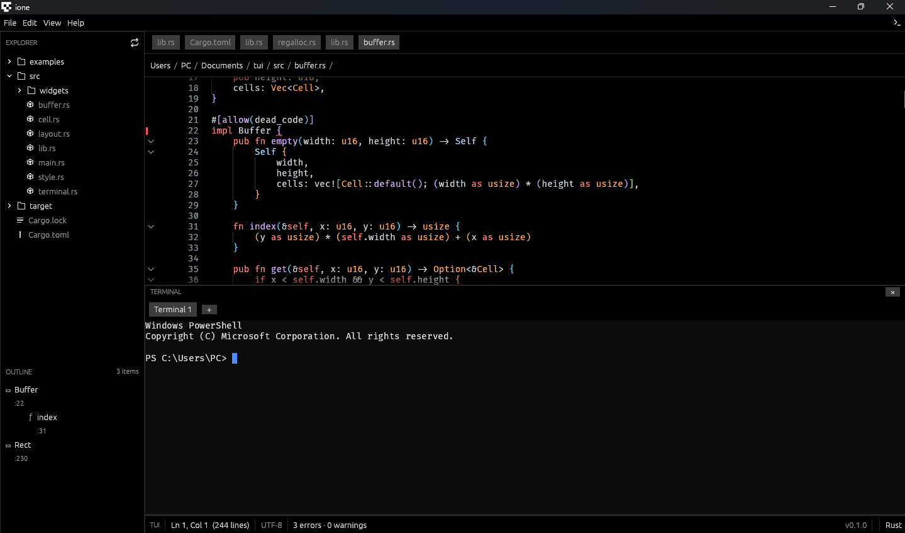

<p align="center">
  
</p>

<h1 align="center">ione</h1>

<p align="center">
  <strong>Editor kode modern dengan terminal PowerShell terintegrasi</strong><br />
  Dibangun dengan Rust, egui/eframe — ringan, cepat, dan fokus.
</p>

<p align="center">
  
  
  
  
  
</p>

<p align="center">
  <a href="#fitur"><b>Fitur</b></a> ·
  <a href="#tangkapan-layar"><b>Tangkapan Layar</b></a> ·
  <a href="#persyaratan"><b>Persyaratan</b></a> ·
  <a href="#cara-membangun"><b>Cara Membangun</b></a> ·
  <a href="#shortcut-keyboard"><b>Shortcut</b></a> ·
  <a href="#struktur-proyek"><b>Struktur Proyek</b></a> ·
  <a href="#lisensi"><b>Lisensi</b></a>
</p>

---

## ✨ Fitur

| 🎯 Fitur | 📝 Keterangan |
|---------|---------------|
| **Multi-tab editor** | Buka banyak file sekaligus, syntax highlighting, nomor baris, undo/redo |
| **Terminal PowerShell** | Multi-session nyata (portable-pty), tab untuk tiap sesi |
| **File Explorer** | Pohon folder, expand/collapse, menu konteks (Open/Rename/Delete/Copy Path) |
| **Find & Replace** | Hasil live, ganti satu-satu atau ganti semua |
| **Code Folding** | Lipat blok `{ … }` dengan `Ctrl+Shift+[` / `Ctrl+Shift+]` |
| **Multi-select edit** | `Ctrl+D` pilih kejadian kata berikutnya, satu ketikan diedit ke semua sekaligus |
| **Error/Warning decoration** | Squiggle merah/kuning + tooltip + count di status bar — deteksi kurung akurat per bahasa: JS/TS/JSX/TSX (template & regex), lifetime/raw-string Rust, tanpa error palsu |
| **Bracket guides** | Panduan pasangan kurung + rainbow brackets (bisa dimatikan via View → Editor Guides) |
| **Outline panel** | Navigasi struktur file aktif |
| **Tema Dark/Light** | Hitam murni & putih, sudut tajam; GitHub Light masih **beta** (ada konfirmasi saat memilih) |
| **Ganti font editor** | 5 font coding gratis: JetBrains Mono, Fira Code, dsb. |
| **Splash screen** | Animasi startup + overlay sesaat saat membuka file besar |
| **About window** | Info lengkap, shortcut, tech stack |

> 📖 Lihat **[FITUR.md](FITUR.md)** untuk penjelasan mendalam termasuk **kelebihan & kekurangan**.

---

## 🖼️ Tangkapan Layar

<p align="center">
  
</p>
<p align="center">
  <em>Tampilan editor ione — code editor multi-tab dengan file explorer & terminal PowerShell terintegrasi.</em>
</p>

---

## 📌 Persyaratan

| Tool | Keterangan |
|------|------------|
| **Rust** | stable toolchain, edition 2024 |
| **OS** | Windows (terminal menggunakan PowerShell bawaan) |

Dependensi utama (di `Cargo.toml`):

| Crate | Versi | Penggunaan |
|-------|-------|------------|
| `eframe` | 0.36 | Framework GUI |
| `egui_code_editor` | 0.3 | Editor kode + syntax highlighting |
| `egui_extras` | 0.36 | Dukungan SVG |
| `resvg` | 0.45 | Render ikon SVG |
| `portable-pty` | 0.8 | Terminal PTY PowerShell |
| `vt100` | 0.16 | Parsing output terminal |
| `rfd` | 0.15 | Dialog file/folder |
| `opener` | 0.8 | Membuka hyperlink/system default |
| `image` | 0.25 | Pemuatan GIF/ICO |

---

## 🛠️ Cara Membangun

```bash
# Pastikan stable Rust terpasang, lalu:
cargo build --release

# Jalankan:
cargo run
```

Untuk iterasi cepat saat pengembangan:

```bash
cargo run
```

> 💡 **Catatan kunci:** sebelum build ulang, hentikan proses berjalan untuk menghindari error file terkunci:
>
> ```powershell
> Get-Process ione -ErrorAction SilentlyContinue | Stop-Process -Force
> Start-Sleep -Milliseconds 300
> cargo build
> ```

---

## ⌨️ Shortcut Keyboard

| Aksi | Shortcut |
|------|----------|
| File Baru | `Ctrl+N` |
| Buka File | `Ctrl+O` |
| Buka Folder | `Ctrl+K Ctrl+O` |
| Simpan | `Ctrl+S` |
| Simpan Sebagai | `Ctrl+Shift+S` |
| Tutup Tab | `Ctrl+W` |
| Find & Replace | `Ctrl+H` |
| Toggle File Explorer | `Ctrl+L` |
| Toggle Terminal | `` Ctrl+` `` |
| Pilih kejadian kata berikutnya | `Ctrl+D` |
| Lipat / Buka blok | `Ctrl+Shift+[` / `Ctrl+Shift+]` |
| Siklus Tab | `Ctrl+Tab` / `Ctrl+Shift+Tab` |

> **Terminal multi-session:** klik kiri = pindah sesi, klik tengah / klik kanan → Close = tutup sesi.

---

## 📁 Struktur Proyek

```
src/
├── main.rs         # Entry point & setup window
├── app/            # EditorApp utama, panel, aksi, perintah
│   ├── mod.rs
│   ├── actions.rs  # Handler perintah
│   ├── panels.rs   # Title bar, status bar, sidebar, About
│   └── utils.rs
├── editor/         # Render editor (widget + overlay)
│   ├── mod.rs      # Editor widget & layouter
│   ├── folds.rs    # Code folding (FoldView/FoldBuffer)
│   ├── multi.rs    # Multi-select edit (Ctrl+D)
│   ├── gutter.rs   # Nomor baris + ikon fold + marker diagnostik
│   ├── styling.rs  # Pipeline pewarnaan sintaks
│   ├── cursor.rs   # Matematika posisi teks
│   └── links.rs    # Hyperlink klik
├── diagnostics.rs  # Analisis error/warning + render squiggle
├── guides/         # Bracket guides, rainbow brackets, geometri
├── tabs.rs         # Manajemen tab file
├── file_tree.rs    # Explorer pohon folder
├── outline.rs      # Panel outline
├── search.rs       # Panel find & replace
├── terminal.rs     # Terminal PowerShell multi-session
├── menu.rs         # Menu bar & shortcut global
├── fonts.rs        # Daftar & pemuatan font coding
├── theme.rs        # Definisi tema (dark/light)
├── style.rs        # Palet & gaya visual
├── icons.rs        # Ikon file/SVG
└── loading.rs      # Splash screen animasi

assets/
├── icons/
│   ├── app/          # Logo aplikasi (.ico) & GIF splash
│   ├── lang/         # Ikon bahasa pemrograman (lang-*.svg)
│   ├── explorer/     # Ikon file/folder untuk panel file tree
│   └── ui/           # Ikon umum UI (save, search, chevron, dll)
├── screenshots/      # Tangkapan layar untuk README
└── fonts/         # Font coding (OFL / Apache)
```

---

## 🚀 Roadmap

- [ ] Menyimpan pengaturan (font, tema, ukuran) secara persisten
- [ ] Auto-complete dasar untuk bahasa populer
- [ ] Panel Git (status, commit, staging)
- [ ] Recent files
- [ ] Minimap & breadcrumb
- [ ] Integrasi build/run → terminal
- [ ] Diagnostik eksternal (`cargo check` / LSP) di samping cek bawaan

---

## 📄 Lisensi

**Kode aplikasi** dilisensikan di bawah **MIT License** — © 2026 [Zulkarnaen Syam Amansyah](LICENSE).

**Font** di `assets/fonts/` **tidak** tercakup MIT dan berada di bawah lisensi masing-masing:
[SIL Open Font License 1.1](https://openfontlicense.org) dan [Apache License 2.0](https://www.apache.org/licenses/LICENSE-2.0). Lihat [LICENSE](LICENSE) untuk perincian.

---

<p align="center">
  Dibuat dengan ❤️ dan Rust &nbsp;·&nbsp; <a href="FITUR.md">Lihat Fitur</a>
</p>
